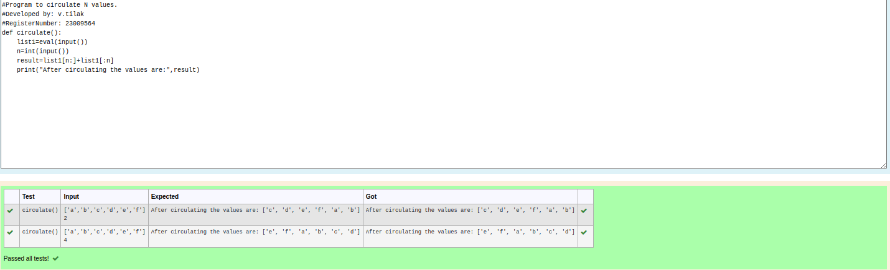

# Circulate-the-values-of-N-variables
## Aim:
To write a python program to circulate the n variables using function concept
## Equipment’s required:
PC
Anaconda - Python 3.7
## Algorithm: 
### Step 1: 
### Step 2: 
### Step 3: 
Get the value from the user for the number of rotation
### Step 4: 
Using the slicing concept rotate the list

### Step 5: 
### Step 6: 
## Program:
```
#Program to circulate N values.
#Developed by: v.tilak
#RegisterNumber: 23009564
def circulate():
    list1=eval(input())
    n=int(input())
    result=list1[n:]+list1[:n]
    print("After circulating the values are:",result)
```

## Output:



## Result:
Thus the the python program for circulate the values of N variables is excuted successfully.
